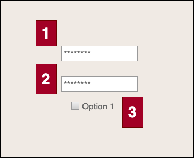

# ログイン画面

## 画面要素

|No|要素名　|種類|Form name|バリデーション|
|-|-------|--|--|--|--|
|1| ユーザー名 |テキスト|username|テキスト100文字まで。メールアドレス形式？|
|2| パスワード |パスワード|password|半角英数100文字まで|
|3| アカウント登録ボタン |ボタン|submit_btn||

## 機能
1. ユーザー名、パスワードを入力し、ログインする。

## エラー処理
1. ユーザー名が存在しなかった場合、エラーメッセージと登録を促すリンクを表示する。
2. パスワードが間違えていた場合、エラーメッセージを
   

## 処理詳細
1. ユーザー名(user_name)、パスワード(password):暗号化でUsersテーブルを検索する。（暗号化処理はLaravelの暗号化処理を使用する（Crypt::encryptString））
2. ユーザー名が存在しない場合、